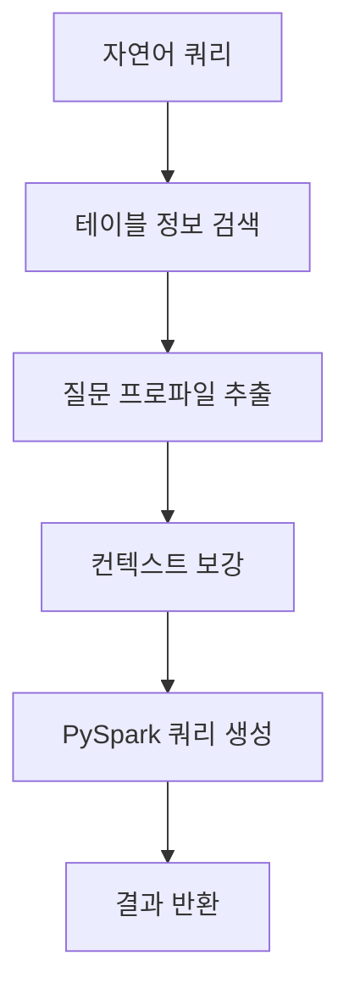

# ⚡ 신위험률 일원화테이블 Text2Pyspark

<p align="center">
  <strong>자연어로 보험 데이터를 분석하세요! 신위험률 일원화테이블을 위한 지능형 PySpark 쿼리 생성 도구 🚀</strong>
</p>

<p align="center">
  <em>"복잡한 보험 데이터 분석을 쉽고 빠르게"</em>
</p>

---

## 🏥 신위험률 일원화테이블 Text2Pyspark란?

보험업계의 신위험률 산출을 위한 일원화테이블 데이터 분석을 자연어로 쉽게 할 수 있는 지능형 도구입니다. 
복잡한 의료 데이터 스키마와 보험 용어에 대한 깊은 지식 없이도, 일상 언어로 정확한 PySpark 쿼리를 생성할 수 있습니다.

### 🎯 주요 기능

- **🗣️ 자연어를 PySpark로 변환**: "난청 환자수를 성별, 연령대별로 집계해줘" → 정확한 PySpark 코드
- **🏥 의료 데이터 특화**: 진단코드, 수술코드, 병원정보 등 의료보험 도메인 최적화
- **📊 스마트 테이블 발견**: 의미론적 검색으로 관련 테이블 자동 탐지 (bill, hosp, dgn, srop 등)
- **🔍 실시간 모니터링**: LangGraph 노드별 실행 과정 시각화
- **🗄️ FAISS 벡터 DB**: 빠른 테이블 메타데이터 검색
- **📈 즉시 실행**: 생성된 쿼리를 바로 확인하고 검증

### 🏥 지원하는 데이터

#### 주요 테이블
- **📋 bill**: 인청구서 데이터 (의료비 청구 정보)
- **🏥 hosp**: 병원 정보 (의료기관 데이터)
- **🩺 dgn**: 진단 정보 (질병 진단 코드)
- **⚕️ srop**: 수술 정보 (수술 및 처치 코드)

#### 분석 영역
- **👂 난청 데이터**: 노년난청 제외한 난청 환자 분석
- **📊 연간 환자수**: CY별 환자 트렌드 분석
- **👥 인구통계**: 성별, 연령 5세단위 집계
- **💰 실손보험**: 실손 데이터 기반 분석

### 🤔 해결하는 문제

보험 데이터 분석팀이 자주 직면하는 문제들:
- 🤯 "수백개의 테이블 중 어떤 걸 써야 하지?"
- 🧐 "ICD 코드와 수술코드를 어떻게 매핑하지?"
- 🐌 "이 조인이 성능상 괜찮을까?"
- 😰 "연령대별 집계 로직이 맞나?"

**Text2Pyspark가 제공하는 해결책:**
- ✅ 자연어 입력 → 적절한 테이블 추천
- ✅ 의료코드 자동 매핑 및 조인 최적화
- ✅ 연령/성별 표준 집계 로직
- ✅ 실시간 쿼리 검증 및 모니터링

---

## 🚀 빠른 시작

### 1️⃣ 설치

```bash
# 저장소 클론
git clone https://github.com/CausalInferenceLab/lang2sql.git
cd lang2sql

# 가상환경 설정 (uv 권장)
uv venv --python 3.11
source .venv/bin/activate  # Windows: .venv\Scripts\activate
uv pip install -e .

# 또는 pip 사용
python -m venv .venv
source .venv/bin/activate
pip install -e .
```

### 2️⃣ 환경 설정

`.env` 파일 생성:

```bash
# LLM 설정
LLM_PROVIDER=openai
OPEN_AI_KEY=sk-your-api-key-here
OPEN_AI_LLM_MODEL=gpt-4o
EMBEDDING_PROVIDER=openai
OPEN_AI_EMBEDDING_MODEL=text-embedding-3-large

# 벡터 DB 설정
VECTORDB_TYPE=faiss
VECTORDB_LOCATION=./table_info_db

# 데이터베이스 타입
DB_TYPE=create  # PySpark 코드 생성 모드
```

### 3️⃣ 실행

```bash
# Streamlit 웹 인터페이스 실행
streamlit run lang2sql/interface/streamlit_app.py

# 또는 CLI 사용
python -m lang2sql.cli query "난청 환자수를 연령대별로 집계하는 쿼리"
```

---

## 🖥️ 사용 인터페이스

### 📱 Streamlit 웹 앱

#### 1. **Text2Pyspark 메인**
- 자연어 쿼리 입력
- 실시간 노드 실행 모니터링
- 생성된 PySpark 코드 확인

#### 2. **DB Builder**
- FAISS 벡터 DB 상태 확인
- 테이블 메타데이터 탐색
- 검색 기능 테스트


### 🔍 실시간 모니터링

LangGraph 워크플로우의 각 단계를 실시간으로 확인:

1. **📋 테이블 정보 검색**: 관련 테이블 자동 탐지
2. **🔍 질문 프로파일 추출**: 쿼리 의도 분석
3. **💡 컨텍스트 보강**: 도메인 지식 추가
4. **⚡ PySpark 쿼리 생성**: 최종 코드 생성

---

## 💡 사용 예시

### 기본 환자수 집계
```
입력: "난청(노년난청제외) 연간환자수를 실손데이터에서 CY별, 성, 연령 5세단위로 집계하는 쿼리"

출력: PySpark 코드 자동 생성
```

### 진단코드 기반 분석
```
입력: "H90-H91 진단코드의 환자를 성별로 분석해줘"

출력: 난청 관련 진단코드 자동 매핑 및 집계
```

### 병원별 환자 분포
```
입력: "지역별 난청 환자 분포를 병원 단위로 보여줘"

출력: 병원-환자 조인 및 지역별 집계
```

---

## 🏗️ 아키텍처

### 🧠 LangGraph 워크플로우



### 🗄️ 데이터 레이어

- **FAISS Vector DB**: 테이블 메타데이터 의미론적 검색
- **CSV 메타데이터**: `table_catalog.csv`의 테이블/컬럼 정보
- **실시간 모니터링**: 각 단계별 실행 상태 추적

---

## 🔧 고급 설정

### 벡터 DB 관리

```bash
# FAISS 인덱스 재생성
python create_faiss.py

# 새로운 테이블 정보 추가
# 1. table_catalog.csv 수정
# 2. FAISS 인덱스 재생성
# 3. 앱 재시작
```

### 모니터링 설정

```python
# 실시간 모니터링 활성화 (기본값: True)
enable_monitoring = True

# 확장된 워크플로우 사용 (기본값: True)  
use_enriched = True
```

---

## 📊 지원하는 분석 유형

### 🏥 의료 데이터 분석
- **환자 수 집계**: 질병별, 연령별, 성별
- **진단 코드 분석**: ICD-10 기반 질병 분류
- **치료 패턴**: 수술/처치 코드 분석
- **의료비**: 청구 금액 및 보장 분석

### 📈 시계열 분석
- **연도별 트렌드**: CY 기준 환자수 변화
- **계절성 분석**: 월별 발생 패턴
- **코호트 분석**: 연령대별 추적

### 🎯 세분화 분석
- **인구통계**: 성별, 연령 5세단위
- **지역별**: 병원 소재지 기준
- **중증도**: 진단코드 세부분류

