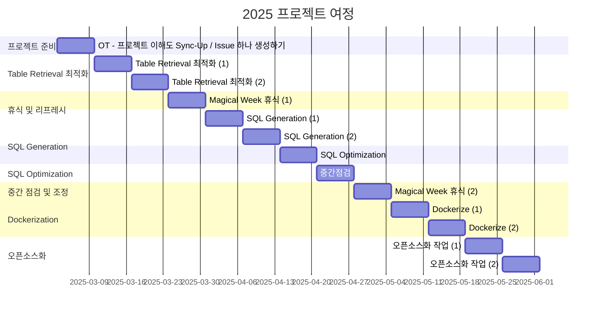

<h1 align="center"> Lang2SQL </h1>

<div align="center">
<a href="https://pseudo-lab.com"></a>
<a href="https://discord.gg/EPurkHVtp2"></a>
<a href="https://github.com/CausalInferenceLab/lang2sql/stargazers"></a>
<a href="https://github.com/CausalInferenceLab/lang2sql/network/members"></a>
<a href="https://github.com/CausalInferenceLab/lang2sql/pulls"></a>
<a href="https://github.com/CausalInferenceLab/lang2sql/issues"></a>
<a href="https://github.com/CausalInferenceLab/lang2sql/graphs/contributors"></a>
<a href="https://hits.seeyoufarm.com"></a>
</div>
<br>

<!-- sheilds: https://shields.io/ -->
<!-- hits badge: https://hits.seeyoufarm.com/ -->

> "우리는 함께 코드와 아이디어를 나누며 더 나은 데이터 환경을 만들기 위한 오픈소스 여정을 떠납니다. 🌍💡"


## 프로젝트 개요 (Project Overview)


`🚀 신입이 SQL을 두려워하지 않도록`

🤔 처음 데이터팀에 합류하면 가장 먼저 마주하는 고민들:
- 🤯 "테이블이 너무 많아! 뭐부터 봐야 하지?"
- 🧐 "조인은 이렇게 걸어도 되나?"
- 🐌 "이 SQL, 성능 괜찮을까?"
- 😰 "어떻게 쿼리해야 인사이트를 얻을 수 있을까?"

💡 Lang2SQL로 해결해 봅시다.
- ✅ 자연어 입력 → 적절한 테이블 추천
- ✅ 올바른 컬럼 조합으로 SQL 자동 생성
- ✅ Best Practice 기반 자동 성능 최적화

🚀 우리는 SQL을 더 쉽게, 더 빠르게, 더 효율적으로 만들 것입니다.

🌍 그리고, 우리는 오픈소스라는 무한한 가능성의 바다로 항해합니다.

## 🌟 프로젝트 목표 (Project Vision)
### _"박치기공룡들의 배포부터 시작하는 프로젝트"_
#### [lang2sql](https://pypi.org/project/lang2sql/) 패키지 1.0.0 달성하기
- 더 이상 실험적인(beta, alpha) 상태가 아니며, 정식 릴리스(Stable Release)임을 뜻합니다.
#### LangGraph 기반 쿼리 생성: 단순한 SQL 생성이 아닌, 최적화된 SQL 제공을 목표로 합니다.
- 자연어(NL) 입력을 기반으로 의미론적으로 최적화된 SQL 생성
- 사내 Best Practice SQL을 통한 성능 향상
#### 오픈소스 협업: 더 많은 사람들이 참여할 수 있도록, 코드와 아이디어를 GitHub으로 공유합니다.
- 이 오픈소스 프로젝트는 전세계 개발자들과 함께 협업하는것을 목표로 합니다.

## 🧑 역동적인 팀 소개 (Dynamic Team)

| 역할          | 이름 |  기술 스택 배지                                                                 | 주요 관심 분야                          |
|---------------|------|-----------------------------------------------------------------------|----------------------------------------|
| **Project Manager** | 이동욱 |   | LLM 오픈소스 인과추론             |
| **ML Engineer** | 이호민 |   | 멀티 에이전트 시스템             |
| **Data Scientist** | 안재일 |   | LLM 데이터분석 RAG             |
| **Data Analytics Engineer** | 박경태 |   | LLM 기반 엔지니어링             |
| **AI Engineer** | 손봉균 |   | LLM RAG AI기획 인과추론             |
| **AI Engineer** | 최세영 |   | LLM RAG 오픈소스 멀티 에이전트            |
| **AI Engineer** | 문찬국 |  | LLM AgenticRAG 오픈소스 


## 🚀 프로젝트 로드맵 (Project Roadmap)



## 🛠️ 우리의 개발 문화 (Our Development Culture)
**우리의 개발 문화**  
```python
class CollaborationFramework:
    def __init__(self):
        self.tools = {
            'communication': 'Discord',
            'version_control': 'GitHub Projects',
            'ci/cd': 'GitHub Actions',
            'docs': 'Github Wiki'
        }
    
    def workflow(self):
        return """주간 사이클:
        1️⃣ 월요일: 코드 리뷰 세션 & 주간목표 설정 (Live Share)
        3️⃣ 금요일: 진행상황 체크 (logging)
```


## 📈 성과 지표 (Achievement Metrics)
**2025 주요 KPI**  
| 지표                     | 목표치 | 현재 달성률 |
|--------------------------|--------|-------------|
| 커밋 수                  | 100  | 0%         |
| 배포 버전 1.0.0 달성              | 1.0.0    | 16%         | 


## 💻 주차별 활동 (Activity History)

| 날짜 | 내용 | 발표자 | 
| -------- | -------- | ---- |
| 2025/03/03 | OT - 프로젝트 이해도 Sync-Up / Issue 하나 생성하기      | 이동욱 |
| 2025/03/10 | 🔍 Table Retrieval 최적화 🔍 | 미정 |
| 2025/03/17 | 🔍 Table Retrieval 최적화 🔍 | 미정 |
| 2025/03/24 | ✨ Magical Week 휴식 ✨| 미정 |
| 2025/03/29 | ✨ 인과추론팀 행사 참여 ✨| 미정 |
| 2025/03/31 | ✏️ SQL Generation ✏️ | 미정 |
| 2025/04/07 | ✏️ SQL Generation ✏️ | 미정 |
| 2025/04/14 | ⚡ SQL Optimization ⚡ | 미정 |
| 2025/04/21 | ✨ 중간점검 ✨ | 미정 |
| 2025/04/28 | ✨ Magical Week 휴식 ✨ | 미정 |
| 2025/05/05 | 🛠️ Dockerize 🛠️ | 미정 |
| 2025/05/12 | 🛠️ Dockerize 🛠️ | 미정 |
| 2025/05/19 | 📖 오픈소스화 작업 📖 | 미정 |
| 2025/05/26 | 📖 오픈소스화 작업 📖 | 미정 |

_"본 계획표는 예시이며, 프로젝트의 방향성을 유지하면서 자유롭게 기여하는 것을 목표로 합니다."_

## 💡 학습 자원 (Learning Resources)

- [모두를 위한 게임 데이터 검색 시스템 / if(kakaoAI)2024](https://www.youtube.com/watch?v=8-GerpWVMis&ab_channel=kakaotech)
- [AI 데이터 분석가 ‘물어보새’ 등장 – 1부. RAG와 Text-To-SQL 활용](https://techblog.woowahan.com/18144/)
- [테디노트 LangGraph](https://wikidocs.net/233785)
- [DataHub 설명](https://datahubproject.io/)
- [vanna.ai](https://github.com/vanna-ai/vanna)

## 🌱 참여 안내 (How to Engage)

### 🎯 우리가 함께 얻어갈 점 (What We’ll Gain)
_"이 스터디에 참여하면서, 여러분이 얻어갈 수 있는 것은 단순한 코드 경험 그 이상입니다."_

- 🔥 오픈소스 기여 경험 – GitHub에서 이슈 관리, PR 작성, 리뷰 등 협업을 경험합니다.
- 🔥 배포 경험 (PyPI & 오픈소스 배포) – lang2sql 패키지를 개발하며 직접 PyPI 패키지를 배포하는 경험을 가질 수 있습니다.
- 🔥 실무 적용 – 본 프로젝트는 완성도를 높여 실무 환경에 적용 예정입니다. ${\textsf{\color{YellowOrange}사이드 프로젝트로 머물지 않습니다.}}$

### 🔍 원하는 팀원 (Who We're Looking For)
_"함께 성장하고, 오픈소스 문화를 즐길 수 있는 팀원을 찾고 있습니다!"_

- **✅ 3개월 동안 꾸준히 참여할 수 있는 의지를 가지신 분**
- ✅ 오픈소스 협업에 관심이 있으신분
- ✅ 최소 주 1회 의미있는 프로젝트 기여 가능하신분 (Issue 생성, 코드기여, 문서화 등등)

### 🤗 비고

**팀원으로 참여하시려면 러너 모집 기간에 신청해주세요.**  
- 링크 (준비중)

**누구나 청강을 통해 모임을 참여하실 수 있습니다.**  
1. 특별한 신청 없이 정기 모임 시간에 맞추어 디스코드 #Room-AN 채널로 입장
2. Magical Week 중 행사에 참가
3. Pseudo Lab 행사에서 만나기

## Acknowledgement 🙏

Lang2SQL is developed as part of Pseudo-Lab's Open Research Initiative. Special thanks to our contributors and the open source community for their valuable insights and contributions.

## About Pseudo Lab 👋🏼</h2>

[Pseudo-Lab](https://pseudo-lab.com/) is a non-profit organization focused on advancing machine learning and AI technologies. Our core values of Sharing, Motivation, and Collaborative Joy drive us to create impactful open-source projects. With over 5k+ researchers, we are committed to advancing machine learning and AI technologies.

<h2>Contributors 😃</h2>
<a href="https://github.com/CausalInferenceLab/lang2sql/graphs/contributors">
  
</a>
<br><br>

<h2>License 🗞</h2>

This project is licensed under the [MIT License](https://opensource.org/licenses/MIT).
